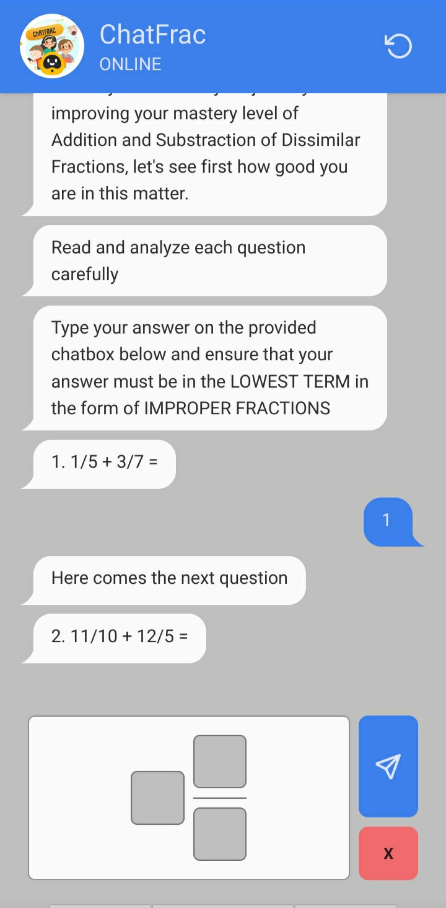
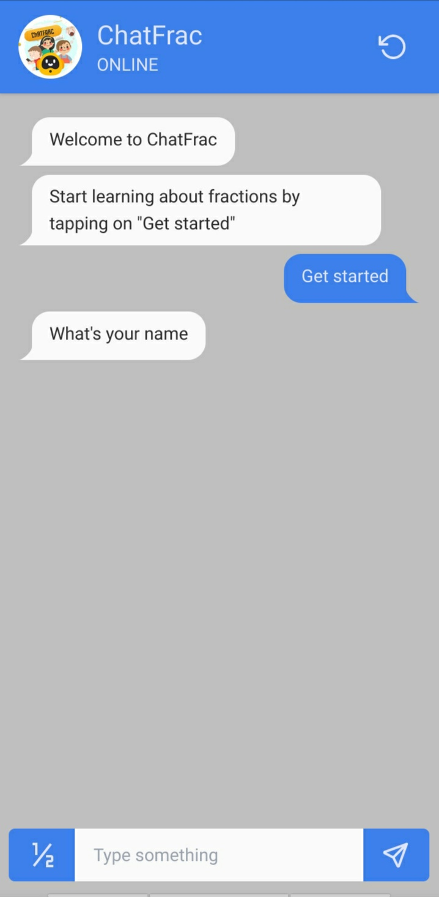

<br/>
<p align="center">
  <h3 align="center">Chatfrac</h3>

  <p align="center">
    a rule-based chatbot for learning fractions
    <br/>
    <br/>
  </p>
</p>

## Screenshots





## Built With

- [Angular]()
- [Tailwind]()
- [DaisyUI]()

### Run

```sh
npm install
```

```sh
ng serve
```
